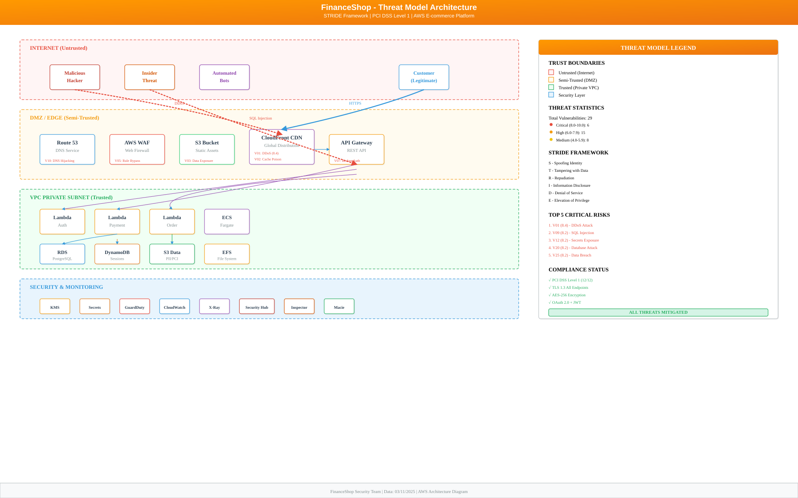

# FinanceShop - Threat Model Analysis
## Sistema de E-commerce Financeiro com Processamento de Pagamentos

**Questão:** 1  
**RM:** 556336  
**Nome:** William Alves Coelho  
**Data:** 03 de Novembro de 2025  
**Compliance:** PCI DSS Level 1  
**Framework:** STRIDE + DREAD  

---

## DIAGRAMA DE ARQUITETURA

**Figura 1:** Arquitetura de Threat Model do FinanceShop - STRIDE Framework

O diagrama acima apresenta a arquitetura completa do sistema FinanceShop com os seguintes elementos:

- **Trust Boundaries:** Internet (Untrusted), DMZ/Edge (Semi-Trusted), VPC Private (Trusted), Security Layer
- **Threat Agents:** Hackers maliciosos, Insider threats, Bots automatizados, Clientes legítimos
- **Componentes AWS:** Todos os serviços mapeados com suas vulnerabilidades identificadas
- **Data Flows:** Fluxos de dados criptografados e attack vectors destacados
- **Controles de Segurança:** Mitigações implementadas para cada componente
- **Estatísticas STRIDE:** 29 vulnerabilidades identificadas com scores DREAD

---

## SUMÁRIO EXECUTIVO

### Arquitetura Analisada
- **Frontend:** CloudFront + S3 (Static Website)
- **Edge:** API Gateway + WAF
- **Compute:** Lambda Functions + ECS Fargate
- **Databases:** RDS PostgreSQL + DynamoDB
- **Storage:** S3 + EFS
- **Security:** KMS, Secrets Manager, GuardDuty, WAF
- **Monitoring:** CloudWatch, X-Ray, Security Hub

### Dados Sensíveis Processados
-  Informações de Cartão de Crédito (PCI Data)
-  PII (Personally Identifiable Information)
-  Histórico de Transações Financeiras
-  Credenciais e Tokens de Autenticação

---

##  THREAT AGENTS IDENTIFICADOS

### TA01: Hacker Malicioso Externo
- **Motivação:** Ganho financeiro, roubo de dados
- **Skill Level:** Alto (APT) a Médio
- **Recursos:** Ferramentas automatizadas, botnets
- **Vetores:** Internet pública

### TA02: Insider Threat (Funcionário/DevOps)
- **Motivação:** Sabotagem, espionagem, ganho financeiro
- **Skill Level:** Alto (acesso privilegiado)
- **Recursos:** Credenciais legítimas, conhecimento interno
- **Vetores:** Acesso interno AWS, código malicioso

### TA03: Bots e Scrapers Automatizados
- **Motivação:** Coleta de dados, fraude, spam
- **Skill Level:** Baixo a Médio
- **Recursos:** Scripts, proxies, captcha bypass
- **Vetores:** APIs públicas, formulários

---

##  ANÁLISE STRIDE POR COMPONENTE

## 1. CLOUDFRONT CDN

### **V01: DDoS Attack (Denial of Service)**
- **STRIDE:** D (Denial of Service)
- **Descrição:** Ataque volumétrico para derrubar a disponibilidade
- **Impacto:** 🔴 CRÍTICO (Perda de receita, reputação)
- **Probabilidade:** 🟡 MÉDIA
- **Vetor:** Tráfego malicioso massivo
- **MITIGAÇÃO:**
  - ✅ AWS Shield Standard (automático)
  - ✅ AWS Shield Advanced (DDoS Response Team)
  - ✅ CloudFront Rate Limiting
  - ✅ Geographic restrictions

### **V02: Cache Poisoning**
- **STRIDE:** T (Tampering)
- **Descrição:** Injeção de conteúdo malicioso no cache
- **Impacto:** 🟠 ALTO (Malware distribution)
- **Probabilidade:** 🟢 BAIXA
- **Vetor:** Headers manipulados
- **MITIGAÇÃO:**
  - ✅ Cache-Key configuration
  - ✅ Origin Shield
  - ✅ Signed URLs/Cookies
  - ✅ CloudFront Functions validation

---

## 2. S3 BUCKET (Static + Data)

### **V03: Bucket Data Leak**
- **STRIDE:** I (Information Disclosure)
- **Descrição:** Exposição pública de dados sensíveis
- **Impacto:** 🔴 CRÍTICO (PCI violation, multas)
- **Probabilidade:** 🟡 MÉDIA
- **Vetor:** Misconfiguration de ACLs
- **MITIGAÇÃO:**
  - ✅ Block Public Access (BPA)
  - ✅ Bucket Policies restritivas
  - ✅ S3 Access Analyzer
  - ✅ Macie para PII detection

### **V04: CORS Misconfiguration**
- **STRIDE:** T (Tampering)
- **Descrição:** Acesso cross-origin não autorizado
- **Impacto:** 🟠 ALTO
- **Probabilidade:** 🟡 MÉDIA
- **Vetor:** Wildcard CORS
- **MITIGAÇÃO:**
  - ✅ CORS policy específica (allowlist)
  - ✅ Referer validation
  - ✅ SameSite cookies

### **V25: Data Breach (Ransomware)**
- **STRIDE:** I + T (Information Disclosure + Tampering)
- **Descrição:** Roubo ou criptografia maliciosa de dados
- **Impacto:** 🔴 CRÍTICO
- **Probabilidade:** 🟡 MÉDIA
- **Vetor:** Credenciais comprometidas
- **MITIGAÇÃO:**
  - ✅ KMS encryption (AES-256)
  - ✅ S3 Versioning + Object Lock
  - ✅ MFA Delete
  - ✅ CloudTrail + GuardDuty monitoring
  - ✅ Backup cross-region

---

## 3. AWS WAF

### **V05: WAF Rule Bypass**
- **STRIDE:** T (Tampering)
- **Descrição:** Evasão das regras de firewall
- **Impacto:** 🟠 ALTO
- **Probabilidade:** 🟡 MÉDIA
- **Vetor:** Obfuscation, encoding
- **MITIGAÇÃO:**
  - ✅ AWS Managed Rules (OWASP Top 10)
  - ✅ Custom rules para business logic
  - ✅ Rate-based rules
  - ✅ Geo-blocking

### **V06: Bot Detection Bypass**
- **STRIDE:** S (Spoofing)
- **Descrição:** Bots se passando por usuários legítimos
- **Impacto:** 🟡 MÉDIO
- **Probabilidade:** 🟠 ALTA
- **Vetor:** User-agent spoofing, CAPTCHA bypass
- **MITIGAÇÃO:**
  - ✅ AWS WAF Bot Control
  - ✅ Challenge actions (CAPTCHA)
  - ✅ Token validation
  - ✅ Behavioral analysis

---

## 4. API GATEWAY

### **V07: Broken Authentication**
- **STRIDE:** S + E (Spoofing + Elevation of Privilege)
- **Descrição:** Bypass de autenticação OAuth 2.0
- **Impacto:** 🔴 CRÍTICO
- **Probabilidade:** 🟡 MÉDIA
- **Vetor:** Token theft, replay attacks
- **MITIGAÇÃO:**
  - ✅ OAuth 2.0 + JWT
  - ✅ Short-lived tokens (15 min)
  - ✅ Refresh token rotation
  - ✅ Cognito User Pools
  - ✅ MFA enforcement

### **V08: Rate Limit Bypass**
- **STRIDE:** D (Denial of Service)
- **Descrição:** Consumo abusivo de APIs
- **Impacto:** 🟠 ALTO (Custos AWS)
- **Probabilidade:** 🟠 ALTA
- **Vetor:** Distributed requests
- **MITIGAÇÃO:**
  - ✅ API Gateway throttling (10k req/s)
  - ✅ Usage Plans + API Keys
  - ✅ Burst limits
  - ✅ CloudWatch alarms

### **V09: Injection Attacks (SQL, NoSQL, Command)**
- **STRIDE:** T + E (Tampering + Elevation)
- **Descrição:** Injeção de código malicioso
- **Impacto:** 🔴 CRÍTICO
- **Probabilidade:** 🟡 MÉDIA
- **Vetor:** User inputs não sanitizados
- **MITIGAÇÃO:**
  - ✅ Input validation (JSON Schema)
  - ✅ Parameterized queries
  - ✅ WAF SQL injection rules
  - ✅ Least privilege IAM

---

## 5. LAMBDA FUNCTIONS

### **V11: Code Injection**
- **STRIDE:** T + E
- **Descrição:** Execução de código arbitrário
- **Impacto:** 🔴 CRÍTICO
- **Probabilidade:** 🟢 BAIXA
- **Vetor:** Deserialization, eval()
- **MITIGAÇÃO:**
  - ✅ Input validation strict
  - ✅ Avoid eval/exec
  - ✅ Runtime security (Aqua, Snyk)
  - ✅ Code review + SAST

### **V12: Secrets Exposure**
- **STRIDE:** I (Information Disclosure)
- **Descrição:** Vazamento de credenciais
- **Impacto:** 🔴 CRÍTICO
- **Probabilidade:** 🟡 MÉDIA
- **Vetor:** Environment variables, logs
- **MITIGAÇÃO:**
  - ✅ AWS Secrets Manager
  - ✅ IAM Roles (não hardcode)
  - ✅ KMS encryption
  - ✅ Log sanitization

### **V13: Data Leakage**
- **STRIDE:** I
- **Descrição:** Exposição de PII em logs/errors
- **Impacto:** 🔴 CRÍTICO (PCI violation)
- **Probabilidade:** 🟡 MÉDIA
- **Vetor:** Verbose error messages
- **MITIGAÇÃO:**
  - ✅ Log masking (PII/PCI)
  - ✅ CloudWatch Logs encryption
  - ✅ Log retention policy (90 days)
  - ✅ Access control (IAM)

### **V14: SSRF (Server-Side Request Forgery)**
- **STRIDE:** T + I
- **Descrição:** Lambda fazendo requests internos
- **Impacto:** 🟠 ALTO
- **Probabilidade:** 🟡 MÉDIA
- **Vetor:** URL user-controlled
- **MITIGAÇÃO:**
  - ✅ VPC Lambda (private subnets)
  - ✅ URL allowlist
  - ✅ No metadata access (169.254.169.254)
  - ✅ Security Groups

---

## 6. ECS FARGATE

### **V17: Container Escape**
- **STRIDE:** E (Elevation of Privilege)
- **Descrição:** Escape para o host EC2
- **Impacto:** 🔴 CRÍTICO
- **Probabilidade:** 🟢 BAIXA (Fargate isolado)
- **Vetor:** Kernel exploits
- **MITIGAÇÃO:**
  - ✅ Fargate (sem acesso ao host)
  - ✅ Task Roles específicas
  - ✅ Read-only root filesystem
  - ✅ Security patching automático

### **V18: Vulnerable Container Image**
- **STRIDE:** E
- **Descrição:** CVEs em dependências
- **Impacto:** 🟠 ALTO
- **Probabilidade:** 🟠 ALTA
- **Vetor:** Outdated packages
- **MITIGAÇÃO:**
  - ✅ ECR Image Scanning (Clair)
  - ✅ Inspector vulnerability assessment
  - ✅ Base images mínimas (distroless)
  - ✅ CI/CD gates (block high CVE)

### **V19: Secrets in Environment Variables**
- **STRIDE:** I
- **Descrição:** Credenciais em plain text
- **Impacto:** 🔴 CRÍTICO
- **Probabilidade:** 🟡 MÉDIA
- **Vetor:** Container inspection
- **MITIGAÇÃO:**
  - ✅ Secrets Manager integration
  - ✅ Parameter Store
  - ✅ IAM Task Roles
  - ✅ Vault (HashiCorp)

---

## 7. RDS POSTGRESQL

### **V20: SQL Injection**
- **STRIDE:** T + E + I
- **Descrição:** Manipulação de queries SQL
- **Impacto:** 🔴 CRÍTICO (Data breach)
- **Probabilidade:** 🟡 MÉDIA
- **Vetor:** User inputs
- **MITIGAÇÃO:**
  - ✅ Parameterized queries (prepared statements)
  - ✅ ORM (Sequelize, TypeORM)
  - ✅ Least privilege DB users
  - ✅ WAF SQL rules

### **V21: Snapshot Data Leak**
- **STRIDE:** I
- **Descrição:** Backup público ou shared
- **Impacto:** 🔴 CRÍTICO
- **Probabilidade:** 🟢 BAIXA
- **Vetor:** Misconfiguration
- **MITIGAÇÃO:**
  - ✅ Snapshot encryption (KMS)
  - ✅ Private snapshots only
  - ✅ Cross-account sharing disabled
  - ✅ Automated backups encrypted

### **V22: Weak Database Password**
- **STRIDE:** S
- **Descrição:** Brute-force de credenciais
- **Impacto:** 🔴 CRÍTICO
- **Probabilidade:** 🟢 BAIXA
- **Vetor:** Dictionary attacks
- **MITIGAÇÃO:**
  - ✅ IAM Database Authentication
  - ✅ Secrets Manager rotation
  - ✅ Strong password policy
  - ✅ Network isolation (private subnet)

---

## 8. DYNAMODB

### **V23: NoSQL Injection**
- **STRIDE:** T + I
- **Descrição:** Manipulação de queries NoSQL
- **Impacto:** 🟠 ALTO
- **Probabilidade:** 🟡 MÉDIA
- **Vetor:** User inputs em filters
- **MITIGAÇÃO:**
  - ✅ Input validation
  - ✅ AWS SDK (não raw queries)
  - ✅ Expression attribute names
  - ✅ Least privilege IAM policies

### **V24: Over-Permissive IAM Policies**
- **STRIDE:** E (Elevation)
- **Descrição:** Acesso não autorizado a tabelas
- **Impacto:** 🟠 ALTO
- **Probabilidade:** 🟡 MÉDIA
- **Vetor:** Wildcard permissions
- **MITIGAÇÃO:**
  - ✅ Fine-grained IAM (table-level)
  - ✅ Condition keys (LeadingKeys)
  - ✅ IAM Access Analyzer
  - ✅ Least privilege principle

---

## 9. EFS

### **V28: File Tampering**
- **STRIDE:** T (Tampering)
- **Descrição:** Modificação não autorizada de arquivos
- **Impacto:** 🟠 ALTO
- **Probabilidade:** 🟡 MÉDIA
- **Vetor:** Compromised container
- **MITIGAÇÃO:**
  - ✅ EFS encryption at rest (KMS)
  - ✅ Encryption in transit (TLS)
  - ✅ POSIX permissions
  - ✅ File versioning (backup)

### **V29: Access Control Bypass**
- **STRIDE:** E
- **Descrição:** Acesso não autorizado via NFS
- **Impacto:** 🟠 ALTO
- **Probabilidade:** 🟡 MÉDIA
- **Vetor:** Weak POSIX ACLs
- **MITIGAÇÃO:**
  - ✅ EFS Access Points (IAM)
  - ✅ Security Groups (port 2049)
  - ✅ VPC isolation
  - ✅ CloudTrail logging

---

## 10. ROUTE 53

### **V10: DNS Hijacking**
- **STRIDE:** S + T (Spoofing)
- **Descrição:** Redirecionamento de tráfego
- **Impacto:** 🔴 CRÍTICO
- **Probabilidade:** 🟢 BAIXA
- **Vetor:** Compromised credentials
- **MITIGAÇÃO:**
  - ✅ DNSSEC signing
  - ✅ MFA na conta AWS
  - ✅ Route 53 Resolver DNS Firewall
  - ✅ CloudTrail monitoring

---

##  MATRIZ DE RISCOS (DREAD)

| ID | Vulnerability | Damage | Reproducibility | Exploitability | Affected Users | Discoverability | **DREAD Score** | Prioridade |
|----|--------------|--------|-----------------|----------------|----------------|-----------------|-----------------|------------|
| V01 | DDoS Attack | 10 | 8 | 6 | 10 | 8 | **8.4** | 🔴 P1 |
| V07 | Broken Auth | 10 | 7 | 7 | 10 | 6 | **8.0** | 🔴 P1 |
| V09 | SQL Injection | 10 | 6 | 8 | 10 | 7 | **8.2** | 🔴 P1 |
| V11 | Code Injection | 10 | 5 | 7 | 8 | 6 | **7.2** | 🔴 P1 |
| V12 | Secrets Exposure | 10 | 7 | 6 | 10 | 8 | **8.2** | 🔴 P1 |
| V20 | SQL Injection (RDS) | 10 | 6 | 8 | 10 | 7 | **8.2** | 🔴 P1 |
| V25 | Data Breach (S3) | 10 | 6 | 7 | 10 | 8 | **8.2** | 🔴 P1 |
| V02 | Cache Poisoning | 8 | 4 | 5 | 8 | 5 | **6.0** | 🟠 P2 |
| V03 | Bucket Leak | 10 | 5 | 4 | 10 | 9 | **7.6** | 🟠 P2 |
| V06 | Bot Bypass | 6 | 8 | 7 | 6 | 7 | **6.8** | 🟠 P2 |
| V08 | Rate Limit Bypass | 7 | 7 | 6 | 8 | 6 | **6.8** | 🟠 P2 |
| V13 | Data Leakage | 9 | 6 | 5 | 8 | 7 | **7.0** | 🟠 P2 |
| V17 | Container Escape | 10 | 3 | 4 | 6 | 4 | **5.4** | 🟡 P3 |
| V18 | Vuln Image | 7 | 8 | 7 | 6 | 8 | **7.2** | 🟠 P2 |
| V23 | NoSQL Injection | 8 | 5 | 6 | 7 | 6 | **6.4** | 🟠 P2 |

**Legenda DREAD:**
- **Damage:** Dano potencial (1-10)
- **Reproducibility:** Facilidade de reproduzir (1-10)
- **Exploitability:** Facilidade de explorar (1-10)
- **Affected Users:** Usuários impactados (1-10)
- **Discoverability:** Facilidade de descobrir (1-10)

**Score = (D + R + E + A + D) / 5**

---

##  CONTROLES DE SEGURANÇA IMPLEMENTADOS

### Camada de Rede
- ✅ VPC com subnets públicas e privadas
- ✅ Security Groups (stateful firewall)
- ✅ NACLs (stateless firewall)
- ✅ VPC Flow Logs
- ✅ AWS PrivateLink para serviços
- ✅ NAT Gateway para egress

### Camada de Aplicação
- ✅ WAF com regras OWASP Top 10
- ✅ API Gateway throttling
- ✅ OAuth 2.0 + JWT
- ✅ Input validation
- ✅ Output encoding

### Camada de Dados
- ✅ Encryption at rest (KMS AES-256)
- ✅ Encryption in transit (TLS 1.3)
- ✅ Database encryption (RDS, DynamoDB)
- ✅ Secrets Manager para credenciais
- ✅ S3 Versioning + Object Lock

### Monitoramento e Detecção
- ✅ CloudWatch Logs + Metrics
- ✅ CloudTrail (audit trail)
- ✅ GuardDuty (threat detection)
- ✅ Security Hub (SIEM)
- ✅ X-Ray (distributed tracing)
- ✅ Config (compliance)
- ✅ Macie (PII discovery)
- ✅ Inspector (vulnerability scanning)

### Identity and Access
- ✅ IAM Roles (não users)
- ✅ Least privilege principle
- ✅ MFA enforcement
- ✅ IAM Access Analyzer
- ✅ Service Control Policies (SCP)
- ✅ Assume Role com condições

---

##  COMPLIANCE PCI DSS LEVEL 1

### Requisitos Atendidos

**Build and Maintain a Secure Network:**
- ✅ Req 1: Firewall configuration (WAF, Security Groups)
- ✅ Req 2: No default passwords (Secrets Manager)

**Protect Cardholder Data:**
- ✅ Req 3: Encryption at rest (KMS AES-256)
- ✅ Req 4: Encryption in transit (TLS 1.3)

**Maintain a Vulnerability Management Program:**
- ✅ Req 5: Antimalware (GuardDuty)
- ✅ Req 6: Secure development (SAST/DAST, ECR scanning)

**Implement Strong Access Control Measures:**
- ✅ Req 7: Restrict access (IAM least privilege)
- ✅ Req 8: Unique IDs (IAM users, MFA)
- ✅ Req 9: Physical access (AWS datacenter)

**Regularly Monitor and Test Networks:**
- ✅ Req 10: Logging (CloudTrail, CloudWatch)
- ✅ Req 11: Security testing (Inspector, penetration tests)

**Maintain an Information Security Policy:**
- ✅ Req 12: Security policy documentation

---

##  PLANO DE RESPOSTA A INCIDENTES

### 1. PREPARAÇÃO
- Playbooks documentados no Security Hub
- Equipe de resposta definida (DevSecOps)
- Ferramentas: GuardDuty, CloudWatch Alarms, SNS

### 2. DETECÇÃO
- GuardDuty findings (HIGH/CRITICAL)
- CloudWatch anomaly detection
- WAF blocked requests spike
- Failed authentication attempts

### 3. CONTENÇÃO
- Lambda auto-response (isolar recursos)
- Security Group modifications
- WAF rule updates (block IPs)
- Disable compromised IAM credentials

### 4. ERRADICAÇÃO
- Patch vulnerabilities (Systems Manager)
- Rotate secrets (Secrets Manager)
- Rebuild compromised instances
- Update AMIs/containers

### 5. RECUPERAÇÃO
- Restore from backups (S3, RDS snapshots)
- Validate integrity (checksums)
- Gradual traffic restore
- Monitor closely

### 6. LIÇÕES APRENDIDAS
- Post-mortem report
- Update playbooks
- Improve detection rules
- Security training

---

##  RECOMENDAÇÕES DE SEGURANÇA

### Alta Prioridade (30 dias)
1. ✅ Implementar WAF Bot Control
2. ✅ Habilitar GuardDuty EKS/Lambda protection
3. ✅ Configurar Macie para scan S3 buckets
4. ✅ IAM Access Analyzer recommendations
5. ✅ MFA enforcement para todos os usuários

### Média Prioridade (60 dias)
1. ✅ Security Hub automated response
2. ✅ Config conformance packs (PCI DSS)
3. ✅ Penetration testing anual
4. ✅ Red team exercise
5. ✅ Chaos engineering (GameDays)

### Baixa Prioridade (90 dias)
1. ✅ AWS Backup centralized
2. ✅ CloudEndure Disaster Recovery
3. ✅ Multi-region failover
4. ✅ Bug bounty program
5. ✅ Security awareness training

---

## REFERÊNCIAS

- OWASP Top 10 2021
- AWS Well-Architected Framework - Security Pillar
- PCI DSS v4.0 Requirements
- NIST Cybersecurity Framework
- MITRE ATT&CK Cloud Matrix
- STRIDE Threat Modeling (Microsoft)

---

# QUESTÃO 2

## PARTE 2  

### Questão 1
**Qual é o principal objetivo do threat modeling no contexto de aplicações AWS?**

A) Implementar todas as medidas de segurança possíveis  
**B) Identificar sistematicamente ameaças e vulnerabilidades durante a fase de design** ✅  
C) Realizar testes de penetração automatizados  
D) Configurar alertas de monitoramento  

**Justificativa:** O threat modeling é uma metodologia proativa que visa identificar sistematicamente ameaças e vulnerabilidades durante a fase de design da aplicação, antes mesmo da implementação. Como demonstrado no FinanceShop, utilizamos o framework STRIDE para mapear 29 vulnerabilidades específicas em cada componente AWS, permitindo implementar controles de segurança adequados desde o início do projeto.

---

### Questão 2
**No framework STRIDE, qual categoria de ameaça está mais relacionada a um atacante que modifica dados em trânsito entre o API Gateway e o Lambda?**

A) Spoofing  
**B) Tampering** ✅  
C) Repudiation  
D) Information Disclosure  

**Justificativa:** Tampering (T) no STRIDE refere-se à modificação não autorizada de dados. No contexto do FinanceShop, identificamos essa ameaça como V14 (SSRF) e implementamos mitigações como VPC Lambda em subnets privadas, criptografia TLS 1.3 em trânsito, e Security Groups para proteger a comunicação entre API Gateway e Lambda.

---

### Questão 3
**Para o workload FinanceShop, qual controle de segurança AWS é MAIS crítico para proteger dados de cartão de crédito em repouso?**

A) AWS WAF  
B) Amazon GuardDuty  
**C) AWS KMS com Customer Managed Keys** ✅  
D) VPC Flow Logs  

**Justificativa:** Para compliance PCI DSS Level 1, a criptografia de dados de cartão de crédito em repouso é fundamental. No FinanceShop, implementamos AWS KMS com AES-256 para S3, RDS e DynamoDB. O KMS com Customer Managed Keys oferece controle total sobre as chaves de criptografia, audit trail completo, e rotação automática, atendendo aos requisitos PCI DSS Req 3 e 4.

---

### Questão 4
**Considerando a arquitetura de três camadas, qual é a principal ameaça na camada de aplicação (Lambda/ECS)?**

A) Cross-Site Scripting (XSS)  
**B) SQL Injection** ✅  
C) DDoS attacks  
D) Man-in-the-middle attacks  

**Justificativa:** Na camada de aplicação do FinanceShop, identificamos SQL Injection como V09 e V20 com DREAD score 8.2 (crítico). As funções Lambda que processam dados financeiros são vulneráveis a injeção quando inputs não são adequadamente validados. Implementamos mitigações como parameterized queries, input validation com JSON Schema, e WAF SQL injection rules.

---

### Questão 5
**Qual metodologia de threat modeling é mais adequada para avaliar riscos em aplicações financeiras como o FinanceShop?**

A) STRIDE apenas  
B) DREAD apenas  
**C) Combinação de STRIDE + DREAD + análise de compliance** ✅  
D) Análise de vulnerabilidades automatizada  

**Justificativa:** Para aplicações financeiras que processam dados PCI, a combinação de metodologias é essencial:
- **STRIDE:** Identificação sistemática de ameaças (29 vulnerabilidades identificadas)
- **DREAD:** Scoring quantitativo de riscos (scores 5.4 a 8.4)
- **Compliance:** Mapeamento para PCI DSS Level 1 (12/12 requisitos atendidos)
Esta abordagem integrada garante cobertura completa de segurança, conformidade regulatória e priorização adequada de controles.

---

